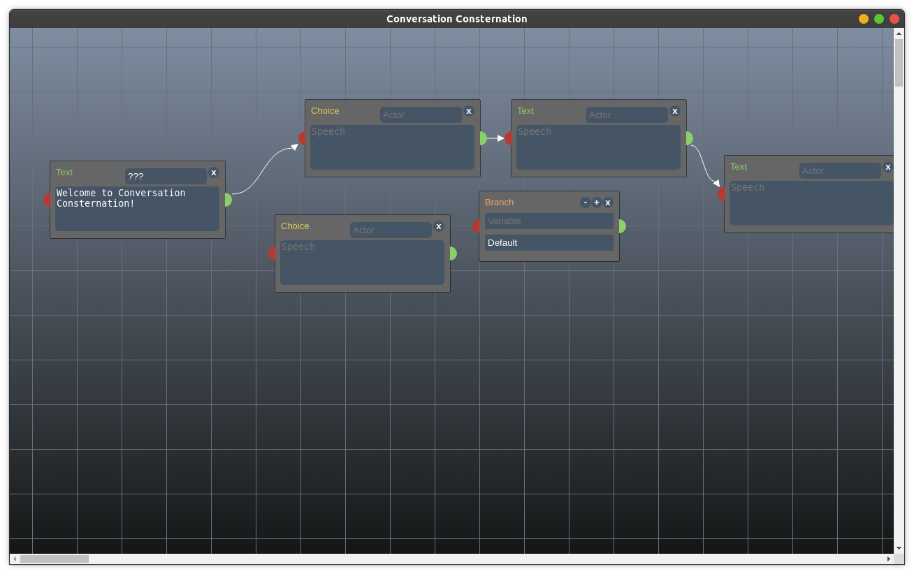

# Conversation Consternation
Interactive node based dialogue editor based on Dialogger by etodd

Requires electron, built with electron-packager.

Node info is stored in the dl file, dialogue stored with json.

